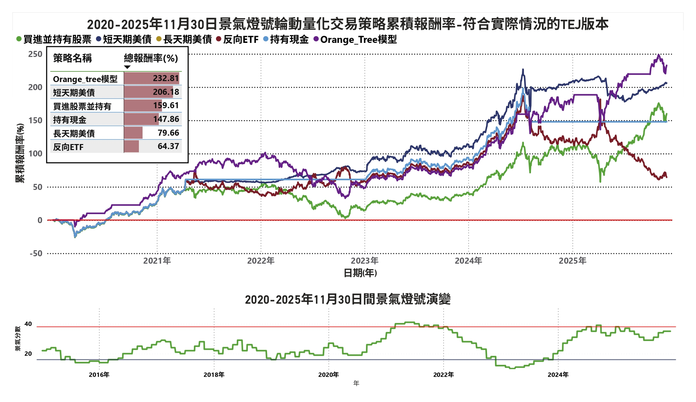
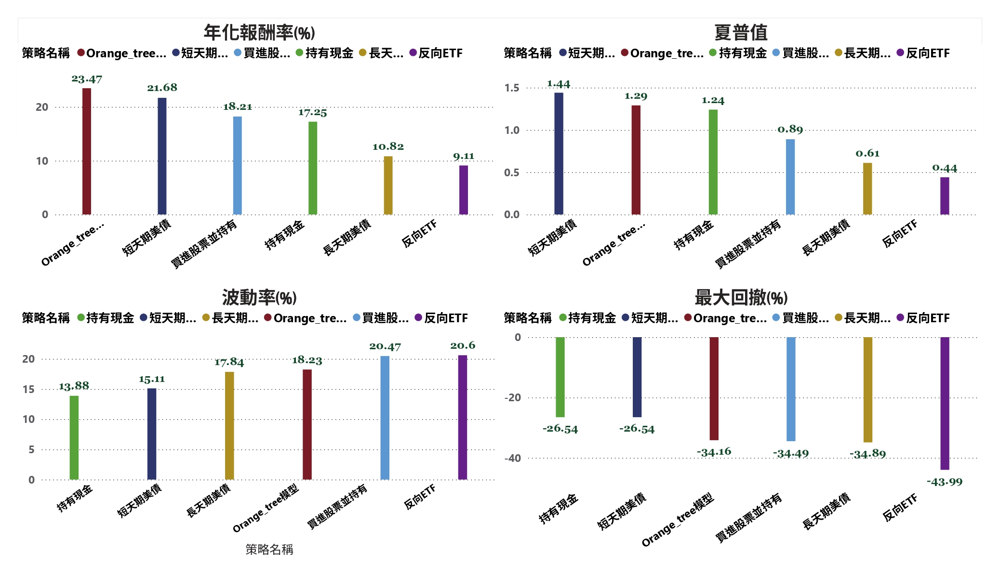

# 景氣週期投資策略系統 🔵🔴✔️

## 這是什麼？

這是一個**量化交易策略系統**，幫助你：

- 📊 根據台灣景氣燈號自動買賣股票
- 🤖 使用機器學習模型預測股價
- 📈 回測策略表現，找出最佳投資時機

## 適合誰？

- ✅ 想學習量化交易的初學者
- ✅ 對景氣循環投資策略感興趣的投資人
- ✅ 想要自動化交易策略的開發者

## 他的績效如何?




---

## 快速開始 🚀

### 我想先了解這套系統在做甚麼?

請參考 [景氣週期投資策略系統 - 專案說明文件](docs/PROJECT_CONTEXT.md)

### 第一次使用？

1. **安裝依賴套件**
   ```bash
   pip install -r requirements.txt
   ```

2. **設定資料庫路徑**（如果需要）
   
   資料庫預設路徑：`D:\all_data\taiwan_stock_all_data.db`
   
   如果資料庫位置不同，請修改 `data_collection/database_manager.py` 中的預設路徑。

3. **執行主程式**
   ```bash
   python main.py
   ```

4. **按照選單指示操作**
   - 先選擇「選項 1」讀取景氣燈號資料
   - 再選擇「選項 2」蒐集股票資料
   - 最後選擇「選項 12」執行回測

### 遇到問題？

- **找不到資料庫？** 請確認資料庫路徑是否正確
- **安裝套件失敗？** 請確認已安裝 Python 3.8 以上版本
- **執行錯誤？** 請確認已安裝所有依賴套件（見下方「依賴套件」章節）

---

## 功能說明 📋

### 選項 1：讀取景氣燈號資料

**什麼時候用？**
- 第一次使用專案時
- 需要更新最新的景氣數據時

**怎麼用？**
1. 執行 `python main.py`
2. 選擇選項 1
3. 等待資料讀取完成

**會發生什麼？**
系統會讀取景氣燈號資料，並轉換成每日資料供策略使用。

**資料來源：** `business_cycle/景氣指標與燈號.csv`

---

### 選項 2：蒐集股票和ETF資料

**什麼時候用？**
- 第一次使用專案時
- 需要更新最新的股價資料時

**怎麼用？**
1. 執行 `python main.py`
2. 選擇選項 2
3. 等待資料下載完成（可能需要一些時間）

**會發生什麼？**
系統會從證交所 API 下載所有股票和ETF的股價資料，並儲存到資料庫中。

**注意事項：**
- 下載過程會自動休息 3-5 秒，避免觸發速率限制
- 如果下載失敗，系統會自動重試 3 次

---

### 選項 12：執行回測 🎯

**什麼時候用？**
- 想要測試策略表現時
- 想要比較不同策略的效果時

**怎麼用？**
1. 確保已完成選項 1 和選項 2
2. 執行 `python main.py`
3. 選擇選項 12
4. 選擇要測試的策略
5. 輸入回測日期範圍（或使用預設值）
6. 等待回測完成

**支援的策略：**

| 策略名稱 | 說明 | 適合場景 |
|---------|------|---------|
| **景氣燈號策略** | 根據景氣燈號自動買賣 | 想要跟隨景氣循環 |
| **Orange 機器學習策略** | 使用 AI 預測股價 | 想要使用先進技術 |
| **買進持有策略** | 一直持有股票 | 作為基準比較 |

**回測參數：**
- 起始日期：2020-01-01
- 結束日期：2025-11-30
- 初始資金：預設 1,000,000 元

**回測結果：**
系統會產生 Excel 檔案，包含：
- 每日投資組合價值
- 交易記錄
- 績效指標（報酬率、夏普比率、最大回撤等）

---

## Orange 機器學習策略 🤖

### 這是什麼？

這是一個**自動預測股價**的策略，使用機器學習模型來判斷：
- 📉 股價是否被低估（該買進）
- 📈 股價是否被高估（該賣出）

### 怎麼運作？

1. **模型預測**：使用訓練好的機器學習模型預測股價
2. **比較價格**：比較實際價格和預測價格
3. **決定買賣**：
   - 實際價格 < 預測價格 5% 以上 → 買進（被低估）
   - 實際價格 > 預測價格 5% 以上 → 賣出（被高估）

### 需要什麼？

- Orange 模型文件（.pkcls）- 需要先訓練模型
- 景氣指標資料（選項 1）
- 股票價格資料（選項 2）

### 怎麼使用？

1. 確保已安裝 Orange3 和 PyQt5：
   ```bash
   pip install orange3 PyQt5
   ```

2. 準備 Orange 模型文件（如果還沒有，需要先在 Orange 中訓練模型）

3. 在執行回測時選擇「Orange 預測策略」

**詳細說明：** 請參考 [Orange 模型整合報告](docs/ORANGE_INTEGRATION_REPORT.md)

---

## 策略表現 📊

### 回測結果（2020-2025）

| 策略名稱 | 年化報酬率 | 風險調整報酬 | 最大虧損 | 說明 |
|---------|-----------|------------|---------|------|
| **Orange 模型** | 23.5% | ⭐⭐⭐⭐ | -34% | 使用 AI 預測，報酬最高 |
| **短天期美債** | 21.7% | ⭐⭐⭐⭐⭐ | -26% | 風險較低，表現穩定 |
| **買進持有** | 18.2% | ⭐⭐⭐ | -34% | 傳統策略，作為基準 |
| **現金避險** | 17.3% | ⭐⭐⭐⭐ | -27% | 保守策略 |

**指標說明：**

- **年化報酬率**：每年平均賺多少錢（數字越大越好）
- **風險調整報酬（夏普比率）**：考慮風險後的表現（星星越多越好，⭐⭐⭐⭐⭐ 最好）
- **最大虧損（最大回撤）**：最壞情況下會虧多少錢（數字越小越好，負數表示虧損）

### 如何選擇策略？

- **想要最高報酬？** → 選擇 Orange 模型策略
- **想要穩定收益？** → 選擇短天期美債策略
- **保守型投資者？** → 選擇現金避險策略

---

## 系統架構 📁

```
Business_Cycle_stratgy/
├── data_collection/          # 資料蒐集模組
│   ├── cycle_data_collector.py    # 讀取景氣燈號資料
│   ├── stock_data_collector.py    # 下載股票和ETF資料
│   └── database_manager.py        # 資料庫管理
├── backtesting/              # 回測模組
│   ├── backtest_engine_new.py     # 回測引擎
│   ├── strategy_tej.py            # 景氣燈號策略
│   └── strategy_orange.py         # Orange 機器學習策略
├── orange_data_export/       # Orange 相關
│   ├── export_for_prediction.py   # 資料導出腳本
│   └── inspect_model.py           # 模型檢查工具
├── docs/                     # 文件資料夾
├── main.py                   # 主程式（執行這個）
├── requirements.txt          # 依賴套件清單
└── README.md                 # 本文件
```

---

## 策略邏輯說明 💡

### 景氣燈號策略

根據台灣景氣對策信號（景氣燈號）自動調整投資組合：

- **藍燈（SCORE ≤ 16）**：景氣低迷
  - 動作：買進股票（006208，富邦台50），賣出避險資產
  
- **紅燈（SCORE ≥ 38）**：景氣過熱
  - 動作：賣出股票，買進避險資產（如債券、現金等）
  
- **綠燈/黃燈（16 < SCORE < 38）**：景氣穩定
  - 動作：首次進入時買進股票

### Orange 機器學習策略

使用機器學習模型預測股價，當實際價格偏離預測價格時進行交易：

- **買進條件**：實際價格 < 預測價格 × 95%（被低估 5% 以上）
- **賣出條件**：實際價格 > 預測價格 × 105%（被高估 5% 以上）
- **風險管理**：根據預測穩定性動態調整倉位（20%-100%）

---

## 資料來源 📚

### 景氣燈號資料

- **來源**：政府開放資料
- **檔案**：`business_cycle/景氣指標與燈號.csv`
- **更新頻率**：每月

### 股價資料

- **來源**：證交所公開 API
- **包含**：所有上市股票、ETF、上櫃股票
- **儲存**：SQLite 資料庫
- **更新**：使用選項 2 或選項 5 更新

---

## 依賴套件 📦

### 必要套件

這些套件是系統運作必需的：

| 套件名稱 | 用途 | 安裝方式 |
|---------|------|---------|
| `pandas` | 資料處理和分析 | `pip install pandas` |
| `numpy` | 數值計算 | `pip install numpy` |
| `requests` | 下載資料（從 API） | `pip install requests` |
| `matplotlib` | 繪製圖表 | `pip install matplotlib` |
| `plotly` | 繪製互動式圖表 | `pip install plotly` |
| `openpyxl` | 讀寫 Excel 檔案 | `pip install openpyxl` |

### 選用套件

這些套件只在特定功能需要時才需要：

| 套件名稱 | 用途 | 何時需要 |
|---------|------|---------|
| `orange3` | 機器學習框架 | 使用 Orange 策略時 |
| `PyQt5` | GUI 支援 | 使用 Orange 策略時 |
| `pandas_market_calendars` | 交易日曆 | 計算交易日時 |

### 一鍵安裝

```bash
pip install -r requirements.txt
```

如果使用 Orange 策略，還需要額外安裝：

```bash
pip install orange3 PyQt5
```

---

## 常見問題 ❓

### 安裝相關

**Q: 安裝套件時出現錯誤怎麼辦？**

A: 
1. 確認已安裝 Python 3.8 以上版本
2. 嘗試更新 pip：`python -m pip install --upgrade pip`
3. 如果還是失敗，可以一個一個安裝套件，找出有問題的套件

**Q: 需要安裝哪些套件才能使用 Orange 策略？**

A: 除了基本的套件外，還需要安裝 `orange3` 和 `PyQt5`：
```bash
pip install orange3 PyQt5
```

### 使用相關

**Q: 我該選擇哪個策略？**

A: 
- 如果你想要最高報酬，可以試試 Orange 模型策略
- 如果你想要穩定的收益，可以選擇短天期美債策略
- 如果你是保守型投資者，可以選擇現金避險策略

**Q: 為什麼回測結果和實際交易不同？**

A: 
- 回測是基於歷史資料的模擬，實際交易會受到市場流動性、滑點等因素影響
- 回測不考慮實際交易時的手續費折扣
- 回測假設能夠完美執行交易，實際交易可能有延遲

**Q: 如何調整策略參數？**

A: 
- 景氣燈號策略的參數在 `backtesting/strategy_tej.py` 中
- Orange 策略的參數在 `backtesting/strategy_orange.py` 中（第 89-125 行有詳細註釋）

**Q: 遇到錯誤怎麼辦？**

A: 
1. 確認已安裝所有必要套件
2. 確認資料庫路徑正確
3. 確認已完成選項 1 和選項 2（讀取資料）
4. 查看錯誤訊息，通常會指出問題所在

### 資料相關

**Q: 資料庫檔案在哪裡？**

A: 預設路徑是 `D:\all_data\taiwan_stock_all_data.db`，如果不同，請修改 `data_collection/database_manager.py`

**Q: 資料庫檔案會上傳到 GitHub 嗎？**

A: 不會，資料庫檔案已設定為不上傳（見 `.gitignore`），請自行保管資料庫檔案。

**Q: 如何更新最新的資料？**

A: 使用「選項 2」更新股票資料，使用「選項 5」批次更新資料。

---

## 資料庫結構 💾

本專案使用 SQLite 資料庫儲存所有資料。

**主要資料表：**

- `tw_stock_price_data`：上市股票和ETF每日股價資料
- `tw_otc_stock_price_data`：上櫃股票每日股價資料
- `business_cycle_data`：景氣燈號每日資料

**詳細說明：** 請參考 [資料庫結構說明文件](docs/DATABASE_SCHEMA.md)

---

## 其他功能 🔧

### 資料驗證與修正

系統提供多種資料驗證與修正功能（選項 6-9）：

- **選項 6**：驗證股價資料（檢查異常值）
- **選項 7**：檢查資料完整性
- **選項 8**：填補零值價格資料
- **選項 9**：刪除權證資料

### 資料分析工具

- **Power BI 連接**：請參考 [Power BI 連接指引](docs/POWER_BI_SETUP.md)
- **Orange 預測分析**：請參考 [Orange 模型整合報告](docs/ORANGE_INTEGRATION_REPORT.md)

---

## 授權 📄

本專案僅供**學習和研究使用**。

**免責聲明：**
- 本專案提供的策略和建議僅供參考，不構成投資建議
- 投資有風險，請謹慎決策
- 過去績效不代表未來表現

---

## 參考資料 📖

- TEJ 台灣經濟新報：從景氣燈號到資產輪動：一套避開熊市的量化策略
- 證交所公開資料 API
- 櫃買中心公開資料 API

---

## 更多資訊 ℹ️

- **詳細技術文件**：請查看 `docs/` 資料夾
- **資料庫結構**：[資料庫結構說明](docs/DATABASE_SCHEMA.md)
- **Orange 策略詳情**：[Orange 模型整合報告](docs/ORANGE_INTEGRATION_REPORT.md)
- **GitHub 上傳指引**：[GitHub 上傳指引](docs/GITHUB_SETUP.md)
